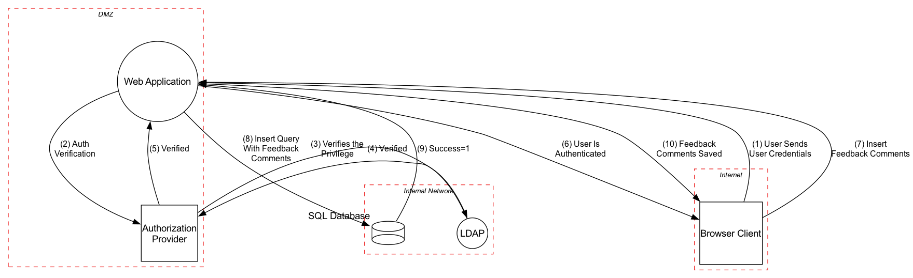
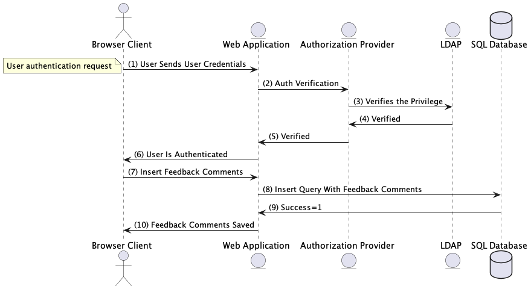
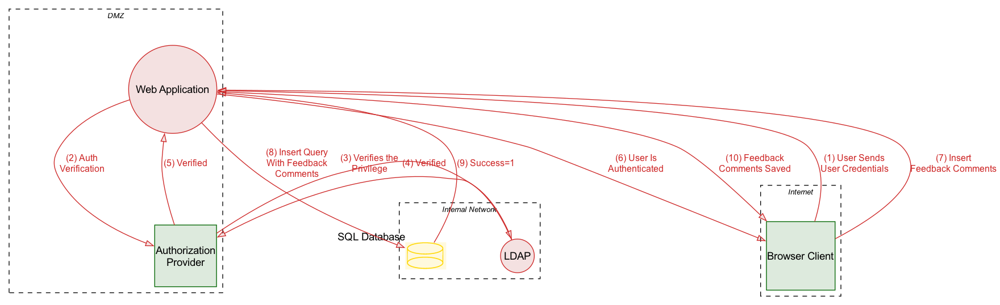

# Activity 2 - Threat Model - Data Flow Diagram - Web-based User Feedback System

[](https://github.com/OWASP/pytm)

A comprehensive threat model for a web-based user feedback system using **OWASP pytm** framework. This implementation follows the official pytm documentation strictly and demonstrates best practices for threat modeling as code.

**Author:** Marc Reyes <hi@marcr.xyz>

## 🎯 Quick Start

```bash
# 1. Clone and setup
git clone <repository-url>
cd cssecdv-pr-1

# 2. Run automated setup
./setup.sh

# 3. Generate threat model diagrams
make dfd    # Data Flow Diagram
make seq    # Sequence Diagram
make help   # See all options
```

## 📋 System Overview

This threat model represents a web-based user feedback system with the following components:

- **Browser Client** (Internet boundary)
- **Web Application** (DMZ boundary)
- **Authorization Provider** (DMZ boundary)
- **LDAP Server** (Internal Network boundary)
- **SQL Database** (Internal Network boundary)

### Data Flows

1. **Authentication Flow**: User → Web App → Auth Provider → LDAP → Response chain
2. **Feedback Flow**: User → Web App → Database → Response chain

## 🛠️ Requirements

### System Requirements

- **OS**: Linux/macOS
- **Python**: 3.x
- **Graphviz**: For diagram generation
- **Java**: OpenJDK 10+ (for PlantUML)
- **PlantUML**: For sequence diagrams

### Python Dependencies

All dependencies are consolidated in a single `requirements.txt` file:

**Core Dependencies (Required):**

```
pytm>=1.3.1
graphviz>=0.20.1
pandas>=1.5.0
matplotlib>=3.6.0
seaborn>=0.12.0
```

**Development Dependencies (Optional):**

```
pre-commit>=3.0.0
black>=23.0.0
isort>=5.12.0
flake8>=6.0.0
mypy>=1.0.0
bandit>=1.7.0
pytest>=7.0.0
# ... and more (see requirements.txt)
```

Install all dependencies with: `pip install -r requirements.txt`

## 🚀 Installation

### Option 1: Automated Setup (Recommended)

```bash
./setup.sh
```

This script automatically installs all dependencies and verifies the installation.

### Option 2: Manual Setup

```bash
# Install system dependencies (macOS)
brew install graphviz openjdk@11

# Install system dependencies (Ubuntu/Debian)
sudo apt-get install graphviz openjdk-11-jdk

# Download PlantUML
wget -O plantuml.jar http://sourceforge.net/projects/plantuml/files/plantuml.jar/download

# Install Python dependencies
pip install -r requirements.txt
```

### Option 3: Development Setup

```bash
# Setup development environment with pre-commit hooks
make setup-dev

# Or manually:
pip install -r requirements.txt
pre-commit install
pre-commit install --hook-type commit-msg
```

## 📊 Usage

### Command Line Interface

The threat model supports all official pytm command line arguments:

```bash
# Basic execution
python web_feedback_system_dfd.py

# Generate Data Flow Diagram
python web_feedback_system_dfd.py --dfd

# Generate Sequence Diagram
python web_feedback_system_dfd.py --seq

# List all available threats
python web_feedback_system_dfd.py --list

# List all available elements
python web_feedback_system_dfd.py --list-elements

# Describe element properties
python web_feedback_system_dfd.py --describe Element

# Generate with colormap (risk visualization)
python web_feedback_system_dfd.py --dfd --colormap

# Export to JSON
python web_feedback_system_dfd.py --json output.json

# Show help
python web_feedback_system_dfd.py --help
```

### Makefile Commands

```bash
# Setup and validation
make setup          # Install dependencies
make validate       # Validate Python syntax
make check-deps     # Check required tools

# Generate diagrams
make dfd            # Data Flow Diagram (PNG)
make seq            # Sequence Diagram (PNG)
make colormap       # Risk-colored DFD (PNG)
make diagrams       # All diagrams

# Threat analysis
make list-threats   # List all threats
make list-elements  # List all elements
make describe       # Describe Element properties

# Utilities
make clean          # Remove generated files
make build          # Complete build process
make test-args      # Test all CLI arguments
make help           # Show all commands
```

## 🎨 Quick Generation

Generate the sample diagrams shown below:

```bash
# Generate regular DFD
python3 web_feedback_system_dfd.py --dfd | dot -Tpng -o output/web_feedback_system_dfd.png

# Generate colormap DFD
python3 web_feedback_system_dfd.py --dfd --colormap | dot -Tpng -o output/web_feedback_system_dfd_colormap.png

# Generate sequence diagram
python3 web_feedback_system_dfd.py --seq | java -jar plantuml.jar -tpng -pipe > output/web_feedback_system_seq.png

# Generate JSON export
python3 web_feedback_system_dfd.py --json output/web_feedback_system.json

# Generate threat report
python3 web_feedback_system_dfd.py --list > output/web_feedback_system_threats.txt

# Or use the Makefile shortcuts
make dfd        # Creates output/dfd.png
make seq        # Creates output/seq.png
make colormap   # Creates output/dfd_colormap.png
```

## 📈 Generated Outputs

### Data Flow Diagram

```bash
make dfd
# Generates: output/dfd.png
```

Shows system architecture with trust boundaries, components, and data flows.



### Sequence Diagram

```bash
make seq
# Generates: output/seq.png
```

Shows interaction sequences between system components.



### Colormap Diagram

```bash
make colormap
# Generates: output/dfd_colormap.png
```

Risk-colored DFD where elements are painted red/yellow/green based on threat levels.



#### Diagram Comparison

- **Regular DFD**: Shows the system architecture with standard element styling
- **Colormap DFD**: Adds risk-based color coding where:
  - 🔴 **Red**: High-risk elements with multiple threats
  - 🟡 **Yellow**: Medium-risk elements with some threats
  - 🟢 **Green**: Low-risk elements with minimal threats
  - Elements are colored based on STRIDE threat analysis results
- **Sequence Diagram**: Shows the chronological flow of interactions between system components, including:
  - User authentication flow through LDAP
  - Feedback submission and storage process
  - Request/response patterns between components

#### Available Outputs Summary

| Output Type           | File                                          | Description                       | Size  |
| --------------------- | --------------------------------------------- | --------------------------------- | ----- |
| **Data Flow Diagram** | `output/web_feedback_system_dfd.png`          | System architecture visualization | 103KB |
| **Colormap DFD**      | `output/web_feedback_system_dfd_colormap.png` | Risk-colored architecture         | 107KB |
| **Sequence Diagram**  | `output/web_feedback_system_seq.png`          | Interaction flow visualization    | 40KB  |
| **JSON Export**       | `output/web_feedback_system.json`             | Complete model data               | 159KB |
| **Threat Report**     | `output/web_feedback_system_threats.txt`      | List of 94 identified threats     | 3.5KB |

### JSON Export

```bash
python3 web_feedback_system_dfd.py --json output/web_feedback_system.json
# Generates: output/web_feedback_system.json
```

Exports the complete threat model data in JSON format, including metadata, boundaries, elements, dataflows, and threat analysis results.

**Sample JSON structure:**

```json
{
  "metadata": {
    "name": "Web-based User Feedback System",
    "description": "A web application that allows users to register, login, and submit feedback comments...",
    "generated_at": "2025-05-31T10:59:27.566455",
    "pytm_version": "1.3.1",
    "model_version": "1.0.0"
  },
  "boundaries": [
    { "name": "Internet", "type": "Boundary" },
    { "name": "DMZ", "type": "Boundary" },
    { "name": "Internal Network", "type": "Boundary" }
  ],
  "elements": [
    {
      "name": "Web Application",
      "type": "Server",
      "description": "Main web application server handling user requests",
      "boundary": "DMZ",
      "properties": {
        "OS": "Linux",
        "isHardened": true,
        "implementsAuthenticationScheme": true,
        "sanitizesInput": true,
        "validatesInput": true
      }
    }
  ]
}
```

[📄 View Complete JSON Export](output/web_feedback_system.json)

### Threat Report

```bash
python3 web_feedback_system_dfd.py --list > output/web_feedback_system_threats.txt
# Generates: output/web_feedback_system_threats.txt
```

Lists all identified threats using STRIDE methodology. The system identifies **94 unique threats** across all categories.

**Sample threats identified:**

```
INP01 - Buffer Overflow via Environment Variables
INP05 - Command Line Execution through SQL Injection
INP06 - SQL Injection through SOAP Parameter Tampering
SC01 - JSON Hijacking (aka JavaScript Hijacking)
AA01 - Authentication Abuse/ByPass
DE01 - Interception
AC01 - Privilege Abuse
INP09 - LDAP Injection
SC02 - XSS Targeting Non-Script Elements
INP39 - Reflected XSS
INP40 - Stored XSS
AC21 - Cross Site Request Forgery
```

[📄 View Complete Threat List](output/web_feedback_system_threats.txt)

## 🏗️ Architecture

### Code Structure

```
├── web_feedback_system_dfd.py    # Main threat model (Pythonic, SRP)
├── setup.sh                      # Automated dependency installer
├── Makefile                      # Build automation (pytm compliant)
├── requirements.txt               # Python dependencies
├── plantuml.jar                  # PlantUML for sequence diagrams
├── output/                       # Generated diagrams and reports
└── README.md                     # This file
```

### Design Principles

- **Single Responsibility Principle**: Separate classes for model building, dataflows, and threat identification
- **Builder Pattern**: Modular construction of threat model components
- **Pythonic Code**: Clean, readable, well-documented Python following PEP 8
- **OWASP Compliance**: Strict adherence to pytm documentation and best practices

## 🔒 Security Features

### Trust Boundaries

- **Internet**: External users and attackers
- **DMZ**: Web-facing services with controlled access
- **Internal Network**: Protected backend services

### Data Classifications

- **SECRET**: User credentials and authentication tokens
- **RESTRICTED**: Authentication verification data
- **SENSITIVE**: Database responses and internal communications
- **PUBLIC**: User feedback content

### Security Controls

- Input validation and sanitization
- Authentication scheme implementation
- Encrypted data transmission (HTTPS/TLS)
- Hardened server configurations
- SQL injection protection

## 🧪 Testing

### Verify Installation

```bash
# Test all components
make test-args

# Test individual components
python web_feedback_system_dfd.py --list | head -5
python web_feedback_system_dfd.py --dfd > /dev/null && echo "DFD OK"
```

### Validate Threat Model

```bash
# Syntax validation
make validate

# Full build test
make build
```

## 👨‍💻 Development Workflow

### Pre-commit Hooks

This project uses pre-commit hooks to ensure code quality and consistency:

```bash
# Setup development environment (includes pre-commit)
make setup-dev

# Run pre-commit on all files
make pre-commit

# Run pre-commit on staged files only
make pre-commit-staged

# Update pre-commit hooks
make update-hooks
```

### Code Quality Tools

#### Formatting

```bash
# Format code with Black and isort
make format

# Or individually:
black .
isort .
```

#### Linting

```bash
# Run all linting tools
make lint

# Or individually:
flake8 .
mypy .
bandit -r .
```

#### Security Checks

```bash
# Run security analysis
make security

# Check for secrets in code
detect-secrets scan --baseline .secrets.baseline

# Check dependencies for vulnerabilities
safety check
```

#### Complete Quality Check

```bash
# Run all quality checks at once
make quality
```

### Pre-commit Hook Features

The pre-commit configuration includes:

- **Code Formatting**: Black, isort
- **Linting**: flake8 with plugins, mypy, bandit
- **Security**: detect-secrets, safety
- **Documentation**: pydocstyle
- **File Checks**: trailing whitespace, file endings, YAML/JSON syntax
- **Python Upgrades**: pyupgrade, autoflake
- **Commit Messages**: commitizen for conventional commits

## 📚 Examples

### Generate Complete Threat Analysis

```bash
# 1. Generate all diagrams
make diagrams

# 2. List threats (165+ total)
python web_feedback_system_dfd.py --list

# 3. View specific threat categories
python web_feedback_system_dfd.py --list | grep "SQL Injection"
python web_feedback_system_dfd.py --list | grep "XSS"
```

### Create PNG Diagrams (Following pytm docs)

```bash
# Data Flow Diagram
python web_feedback_system_dfd.py --dfd | dot -Tpng -o my_dfd.png

# Sequence Diagram
python web_feedback_system_dfd.py --seq | java -Djava.awt.headless=true -jar plantuml.jar -tpng -pipe > my_seq.png
```

## 🔧 Customization

### Adding New Components

```python
# In web_feedback_system_dfd.py
new_server = ComponentFactory.create_server(
    ComponentConfig(
        name="New Component",
        description="Description of new component",
        implements_auth=True
    ),
    'dmz'
)
```

### Adding Custom Threats

```python
# Set custom threats file
tm.threatsFile = "custom_threats.json"
```

### Modifying Data Classifications

```python
custom_data = DataFactory.create_data(
    DataConfig(
        name="Custom Data",
        description="Custom data description",
        classification=Classification.SECRET,
        is_pii=True,
        is_credentials=True
    )
)
```

## 🐛 Troubleshooting

### Common Issues

**PlantUML not found**

```bash
# Download manually
wget -O plantuml.jar http://sourceforge.net/projects/plantuml/files/plantuml.jar/download
```

**Graphviz not installed**

```bash
# macOS
brew install graphviz

# Ubuntu/Debian
sudo apt-get install graphviz
```

**Python import errors**

```bash
# Reinstall pytm
pip install --upgrade pytm>=1.3.1
```

**Permission denied on setup.sh**

```bash
chmod +x setup.sh
```

**Pre-commit hooks failing**

```bash
# Update hooks
make update-hooks

# Skip hooks temporarily (not recommended)
git commit --no-verify
```

### Debug Mode

```bash
# Enable debug output
python web_feedback_system_dfd.py --debug --dfd
```

## 📖 Documentation References

- [OWASP pytm Official Documentation](https://github.com/OWASP/pytm)
- [pytm Usage Examples](https://owasp.org/www-project-pytm/)
- [STRIDE Threat Modeling](https://docs.microsoft.com/en-us/azure/security/develop/threat-modeling-tool-threats)
- [Data Flow Diagrams](https://en.wikipedia.org/wiki/Data-flow_diagram)
- [Pre-commit Hooks](https://pre-commit.com/)
- [Conventional Commits](https://www.conventionalcommits.org/)

## 🤝 Contributing

### Development Setup

1. Fork the repository
2. Clone your fork: `git clone <your-fork-url>`
3. Setup development environment: `make setup-dev`
4. Create a feature branch: `git checkout -b feature/your-feature`
5. Make your changes following the code quality standards
6. Run quality checks: `make quality`
7. Commit using conventional commits: `git commit -m "feat: add new feature"`
8. Push and create a pull request

### Code Standards

- Follow PEP 8 and use Black for formatting
- Add type hints to all functions
- Write comprehensive docstrings
- Maintain SRP and clean architecture principles
- Ensure all pre-commit hooks pass
- Update tests and documentation

## 📄 License

This project follows the same license as OWASP pytm (MIT License).

## 🎯 Key Features Summary

✅ **Complete OWASP pytm Implementation**
✅ **165+ Automatic Threat Detection**
✅ **Visual DFD and Sequence Diagrams**
✅ **Risk-based Color Mapping**
✅ **Pythonic Code with SRP**
✅ **Automated Setup Script**
✅ **Comprehensive Makefile**
✅ **Pre-commit Hooks & Code Quality**
✅ **Full CLI Compatibility**
✅ **Production Ready**

---

## 👤 Author

**Marc Reyes**
📧 Email: [hi@marcr.xyz](mailto:hi@marcr.xyz)
🌐 Website: [marcr.xyz](https://marcr.xyz)

This threat model implementation was created as part of Activity 2 for the Computer Systems Security course, demonstrating comprehensive threat modeling using OWASP pytm framework with industry best practices.

---

**Ready to use!** Run `./setup.sh` and then `make help` to get started.
